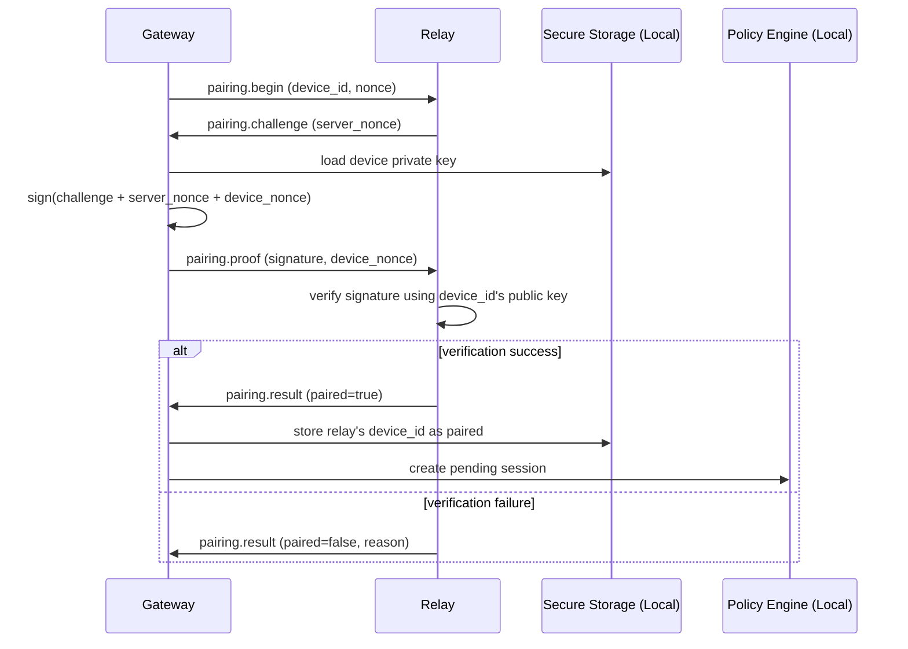
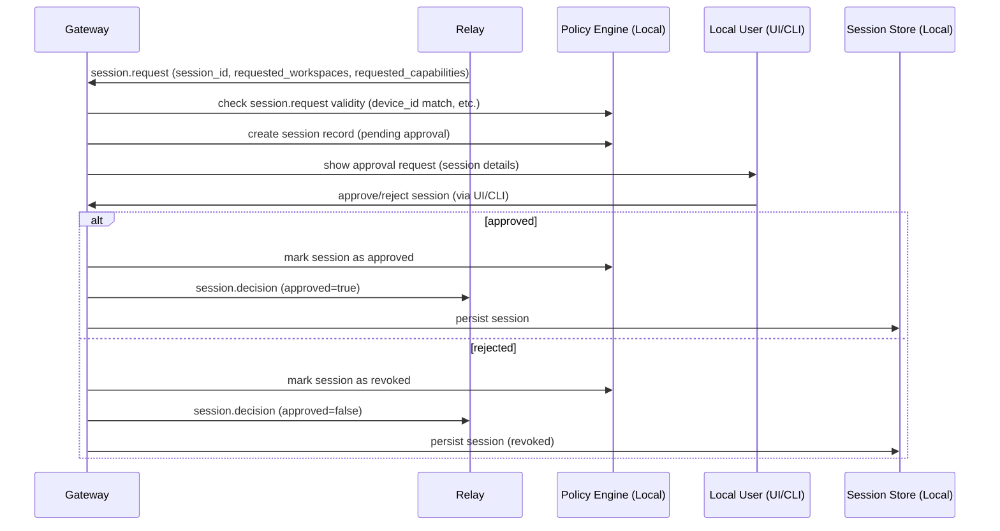
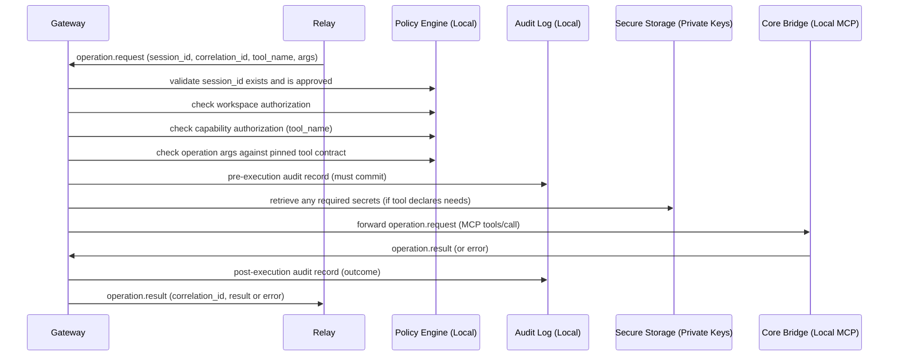
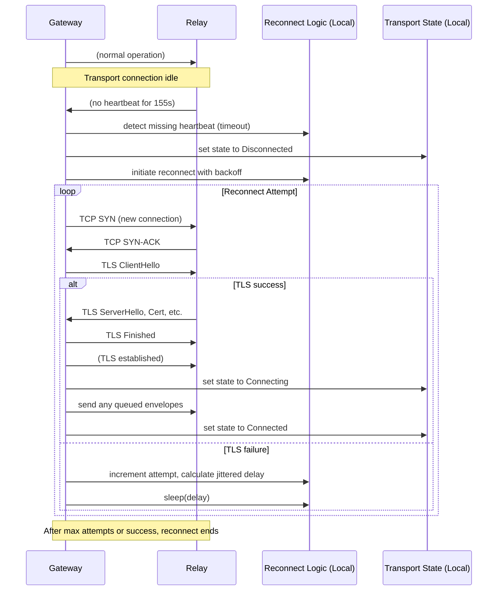
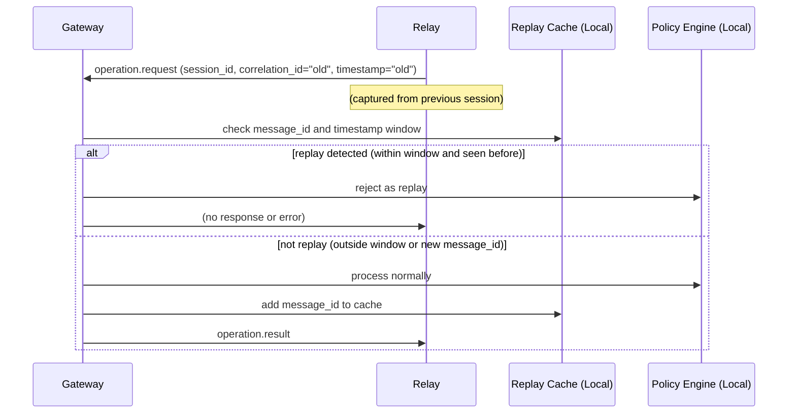
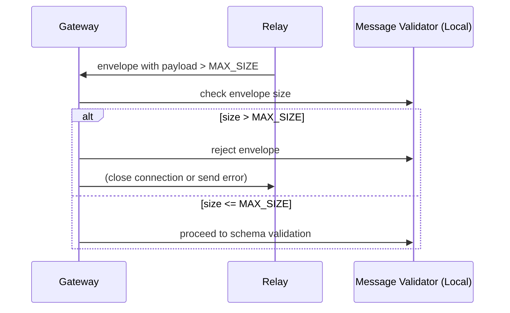
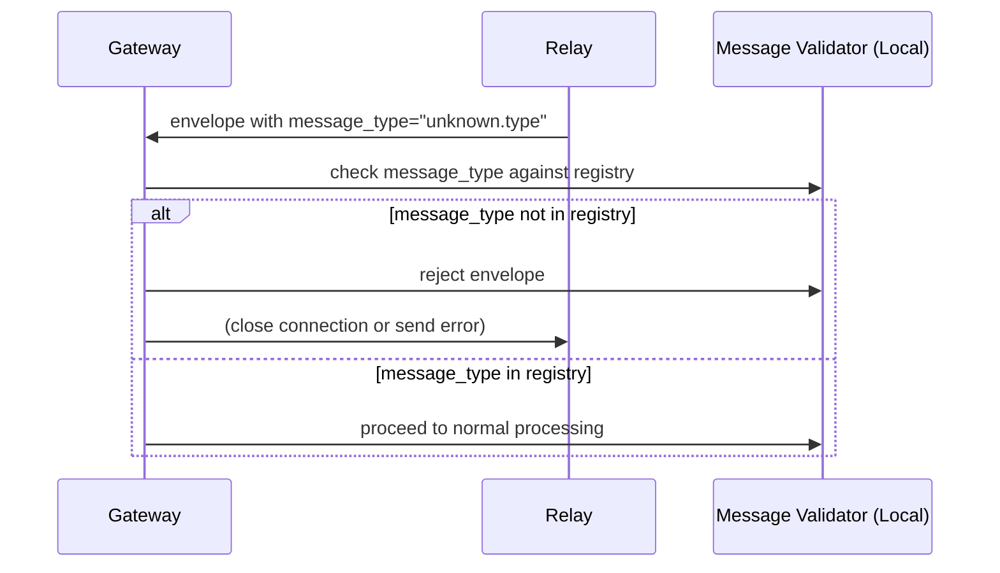

# Sequence Diagrams for Outbound Relay Security Contract

## Pairing Flow



## Session Request and Approval



## Operation Request Flow



## Reconnect After Timeout



## Replay Attack Attempt



## Message Flooding Attempt

```mermaid
sequenceDiagram
    participant Gateway
    participant Relay
    participant RateLimiter as Rate Limiter (Local)
    participant Transport as Transport Layer

    Relay->>Gateway: message 1
    Relay->>Gateway: message 2
    ... (many messages)
    Gateway->>RateLimiter: check each message
    alt message within rate limit
        Gateway->>Transport: process normally
    else message exceeds rate limit
        Gateway->>RateLimiter: drop message
        Gateway->>Relay: (no response or optional error)
        Note over Gateway: If sustained, may close transport connection
    end
```

## Oversized Message Attempt



## Unknown Message Type Attempt



